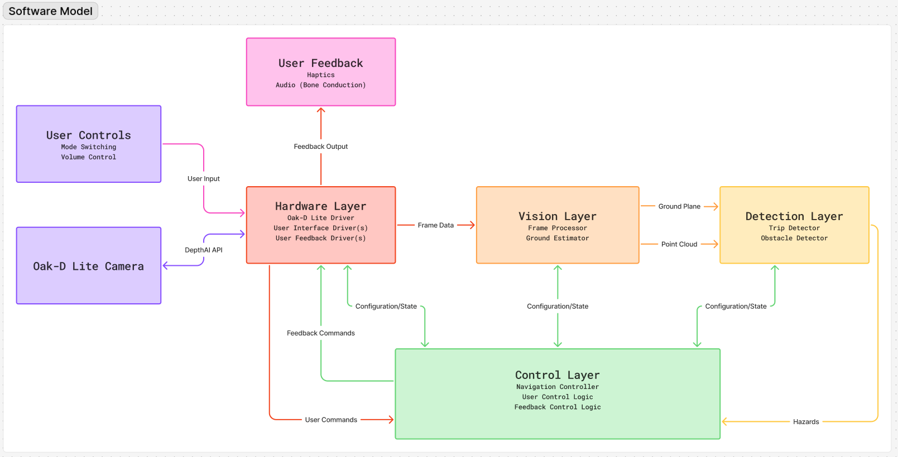

# Trail Navigation Glasses - Vision Pipeline

Part of a senior design capstone project building smart glasses for vision-impaired hikers.

## My Role
Led development of the computer vision pipeline for real-time obstacle detection from stereo depth cameras.

## Technical Implementation
- Stereo → Point Cloud transformation
- Voxel grid discretization
- RANSAC-based ground plane estimation  
- 3D BFS clustering for hazard detection
- Recording/playback tool for integration testing

## Pipeline Architecture

## Technologies
C++, OpenCV, DepthAI

*This represents my individual contributions to a 6-person interdisciplinary team project.*
